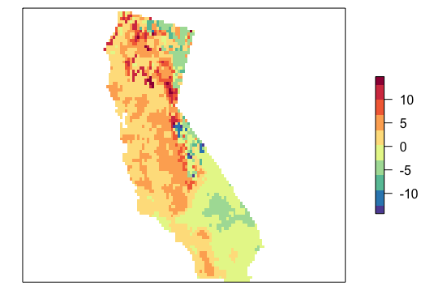
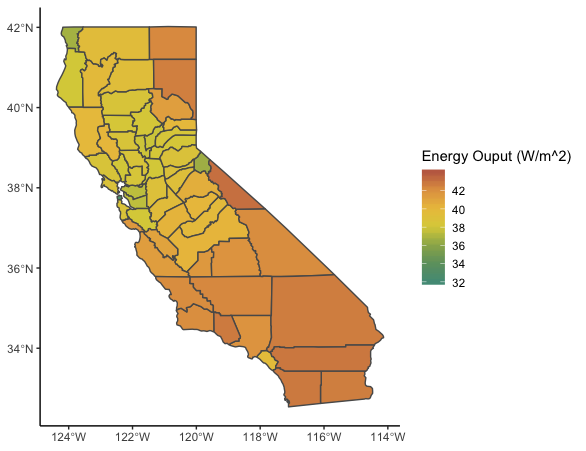
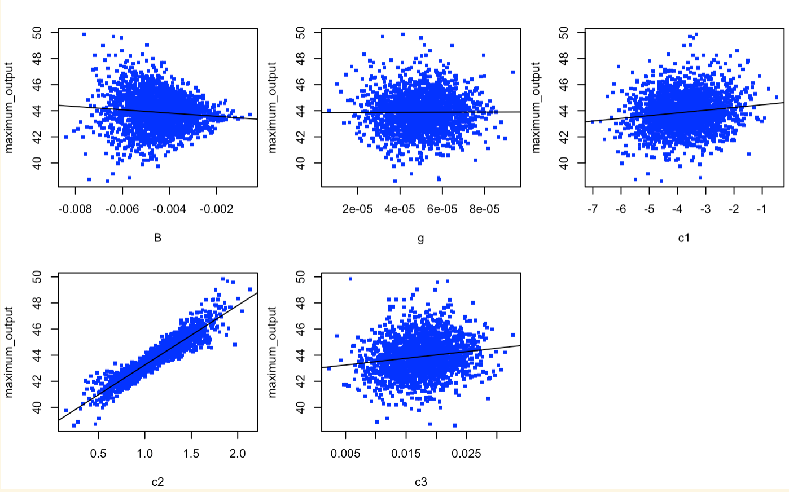
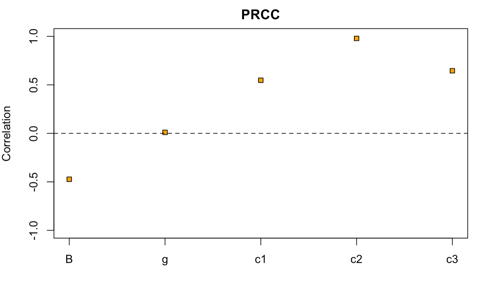
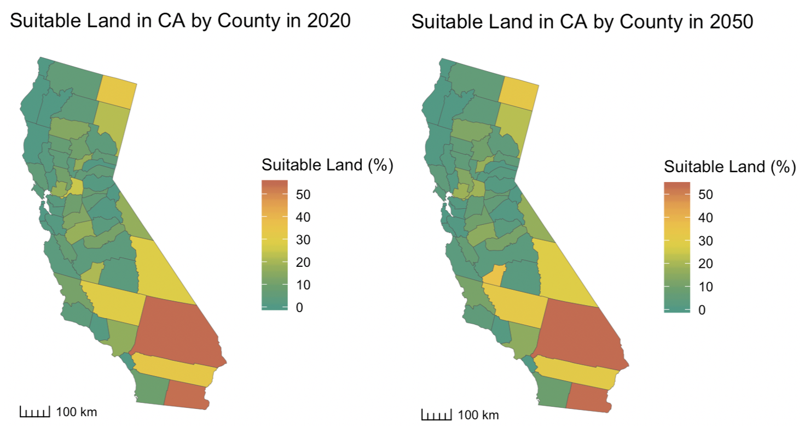
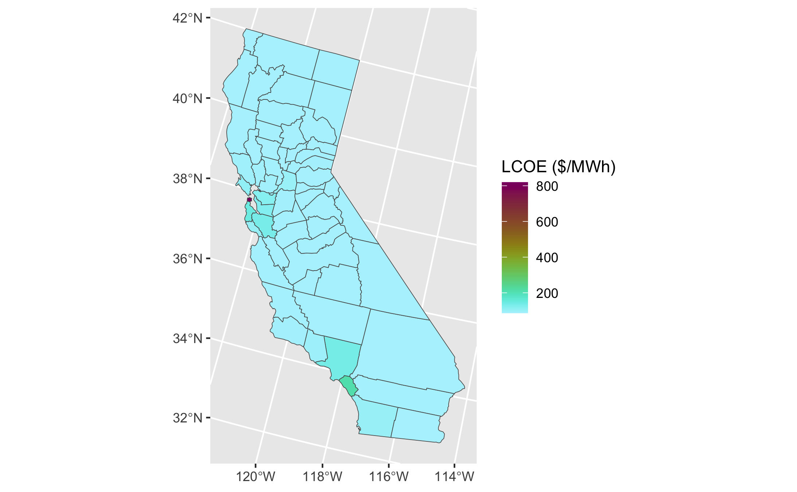
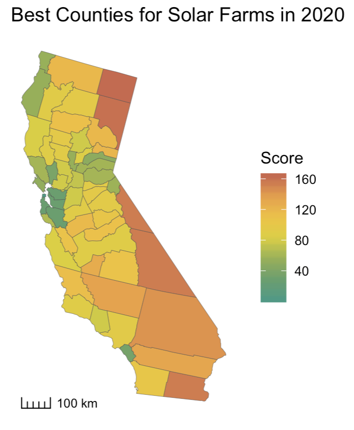

\text{\bfseries\LARGE{Solar Suitability Model}}
\newline
\text{\Large{AnnaClaire Marley, Anna Calle, Ted Jiang}}
\newline
\text{\Large{June 4, 2020}}
\newline
\noindent\makebox[\linewidth]{\rule{\textwidth}{0.4pt}}

```{r, include = FALSE}
library(knitr)
options(tinytex.verbose = TRUE)
```

### Solar Energy Output Submodel

We downloaded raster data from Cal-Adapt using the the CCSM3 climate model under an A2 emissions scenario. To create the solar energy output submodel we used projected monthly minimumum, maximum, and average temperatures as well as net solar insolation data in California for 2020 and 2050. Running this submodel for two different years allows us to conduct analyses on projected change in solar energy output across California. For example, from 2020 to 2050 we can see that generally solar energy output is projected to increase in Northern California and decrease in southeastern California (Figure 1).

```{r, out.width = "80%", fig.align= "center", echo=FALSE}

```

\begin{center}
\textbf{Figure 1.} Percent change in solar energy output 2020 to 2050.
\end{center}

To make our final solar suitability map of California for 2020, we needed to average solar energy output by county (Figure 2). 

```{r, out.width = "80%", fig.align= "center", echo=FALSE}

```

\begin{center}
\textbf{Figure 2.} Average solar energy output by county in 2020.
\end{center}

### Sensitivity Analysis on Solar Output

We tested the sensitivity of the year-round average energy output for the county with maximum output to the five different material parameters *B*, *g*, *$c_1$*, *$c_2$*, and *$c_3$*. We used the Latin hypercube method with 2000 iterations, and assumed all five parameters follow a normal distribution with 25% standard deviation.

Figure 3 shows the five parameter-output correlation plots. Figure 4 shows the partial rank correlation plot for the five parameters.

```{r, out.width = "80%", fig.align= "center", echo=FALSE}

```

\begin{center}
\textbf{Figure 3.} Parameter-output correlation plots for the five material parameters.
\end{center}

```{r, out.width = "80%", fig.align= "center", echo=FALSE}

```

\begin{center}
\textbf{Figure 4.} Partial rank correlation plot for the five parameters.
\end{center}

The analysis shows that the energy output is sensitive to *B*, *$c_1$*, *$c_2$*, and *$c_3$*
, but not very sensitive to *g*. The choice for PV panel material, PV panel design, and emprical equation would all affect the parameters. Hence, it is important to record the changes in *B*, *$c_1$*, *$c_2$*, and *$c_3$* when using this model for a different type of solar farm.

### Land Suitability Submodel

To identify suitable areas for utility-scale solar farms in California we created two functions. The first function produces a raster of all suitable cells in California. It takes slope threshold (%), a land cover raster, and a vector of suitable land cover categories as inputs. We used a default slope threshold of 5%, USGS land change projections, and we considered barren, grasslands, and shrublands as the default suitable categories. The second function takes the output of the first and produces a map of percentage of suitable area by county. We ran these two functions with land cover projections for the years 2020 and 2050. The results (Figure 5) show that the counties with the largest amount of suitable land are located in the southeastern portion of California, where a large portion of land that is desert.

```{r, out.width = "80%", fig.align= "center", echo=FALSE}

```

\begin{center}
\textbf{Figure 5.} Percentage of suitable land available by county in 2020 and 2050.
\end{center}

### Economic Submodel

For the economic submodel, we first downloaded assessed land value data from CA BOE, and calculated the unit land value ($c_{unit land}$, in $\$/m^2$) for each county. To do this, we calculated the area of each county, then divided the total value by the area.

Then, we got the instant cost ($c_{instant}: \$1585/kW$), the installed cost ($c_{installed}: \$1861/kW$), and the O&M cost ($c_{om}:\$8.12/MWh$) from the CA Energy Conmission. We assumed to install a $20000 m^2$) (A) solar farm in every county (about 5 acres), which will operate for 10 years (t).

Finally, we took the energy generation from the solar energy submodel ($gen_{unit}$).

With all these inputs, we used the following equation to calculate the levelized cost of electricty (LCOE) using the following equation.

\begin{equation}
LCOE = \frac{(A*gen_{unit}*c_{instant}+A*gen_{unit}*c_{installed}+A*t*gen_{unit}*c_{om}+A*c_{unit land})}{A*t*gen_{unit}}
\end{equation}

Figure 6 shows the result LCOE for each county in California.

```{r, out.width = "80%", fig.align= "center", echo=FALSE}

```

\begin{center}
\textbf{Figure 6.} LCOE for assumed solar farm for each county in California.
\end{center}

### Solar Suitability Score

The final step of our model is to take scores from each submodel and calculate a final suitability score. To do this, we created a function that allows us to change the weights of the score for each submodel. Figure 7 shows the output of this function using equal weights for the year 2020

```{r, out.width = "50%", fig.align= "center", echo=FALSE}

```

\begin{center}
\textbf{Figure 7.} Final solar suitability scores for counties in CA for the year 2020.
\end{center}
